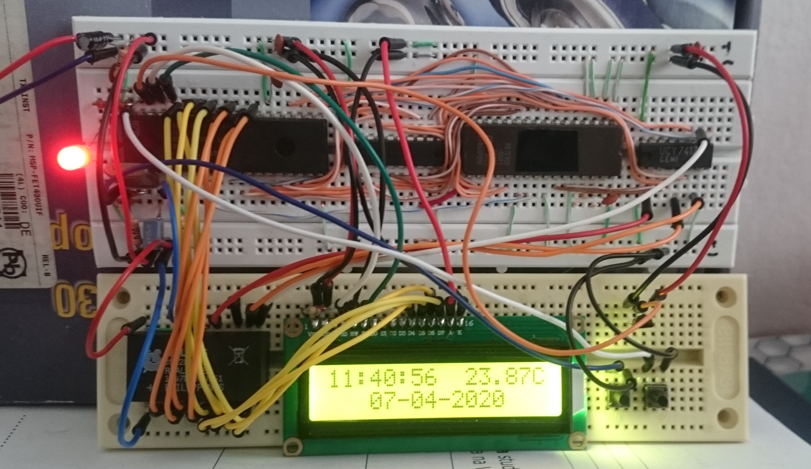

# MAB8049_clock - clock based on Philips MAB8049H, MCS48 series microcontroller

Simple clock and thermometer based on Philips MAB8049H microcontroller I spontaneously bought in
an electronics store years ago just because it was dirt cheap (3PLN, ca. 0.7$) and had this cool 
Philips logo on the case ;) Project done for pure fun, but for some reasons has great educational value. 

Firstly, MAB8049H's internal ROM is factory-programmed with some not-very-useful-for-hobbyists program.
Mainly these chips were used as controllers in TVs, FM tuners or amplifiers; 
Axxx designation after model name indicates what program has been written into the ROM 
(for example A220 was used in polish Diora AS952 tuner; mine is A222, but I haven't found any info about its use).
That program, however, can't be changed - once written, it stays there forever.
The only way to make controller execute our own program is to connect the external memory, 
what SIGNIFICANTLY complicates hardware. 
It was a very good lesson of breadboard prototyping and debugging logic circuits...and importance of power decoupling caps!

Secondly - there's no high-level language compiler for the MCS48. No C, C++, Bascom...nothing. Pure assembly.
Good way to learn how microcontroller works at the very basic, close to the hardware level. 
Personally I used very good SB Assembler which happen to support MCS48, 
Telemark Assembler with -48 switch should work too, but I suppose the code syntax has to be modified slightly. 

Thirdly, instruction list of MCS48 family, to put it mildly, leaves much to be desired.
No subtraction operation, no comparisons...doing any math more complex than summing requires
transformation of the problem to the only two operations available - bit shifts and additions.
Together with the second reason it's an excellent exercise for brain, and the satisfaction 
when after 1496th code correction your algorithm finally works - priceless! 
Then you realize that it's 4:15AM, you should have been asleep for a while...the birds have already 
started singing outside and you are supposed to be at lecture at 8AM...well, who cares, you managed to multiply by 6.25 on MAB8049H, yay!

Useful links that helped me getting started (describe 8042, but it's almost the same as 8049):  
http://bienata.waw.pl/docs/002_EdW_Copy_of_Cyfrowa_archeologia_full.pdf  
http://devster.monkeeh.com/z80/upi42/

### Features

- Based on MAB8049H microcontroller
- External program memory
- DS12887 RTC
- DS18b20 temperature sensor
- Time and temperature displayed on HD44780 16x2 LCD (4-bit mode)
- Written in pure assembly (lots of comments in code)
- Demultiplexed P2.0-P2.4 lines